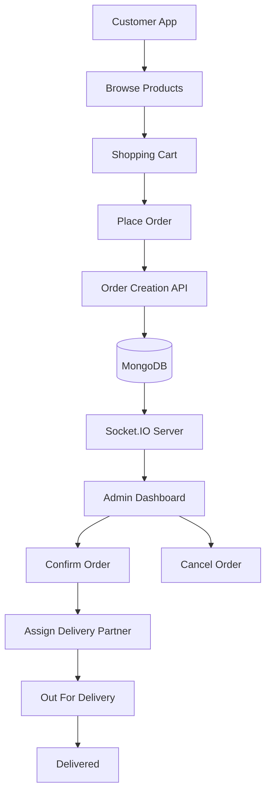
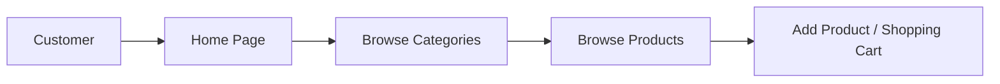
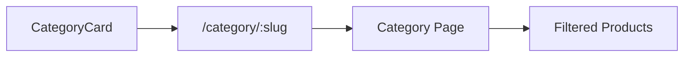
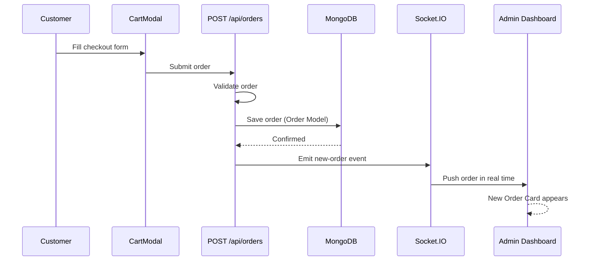
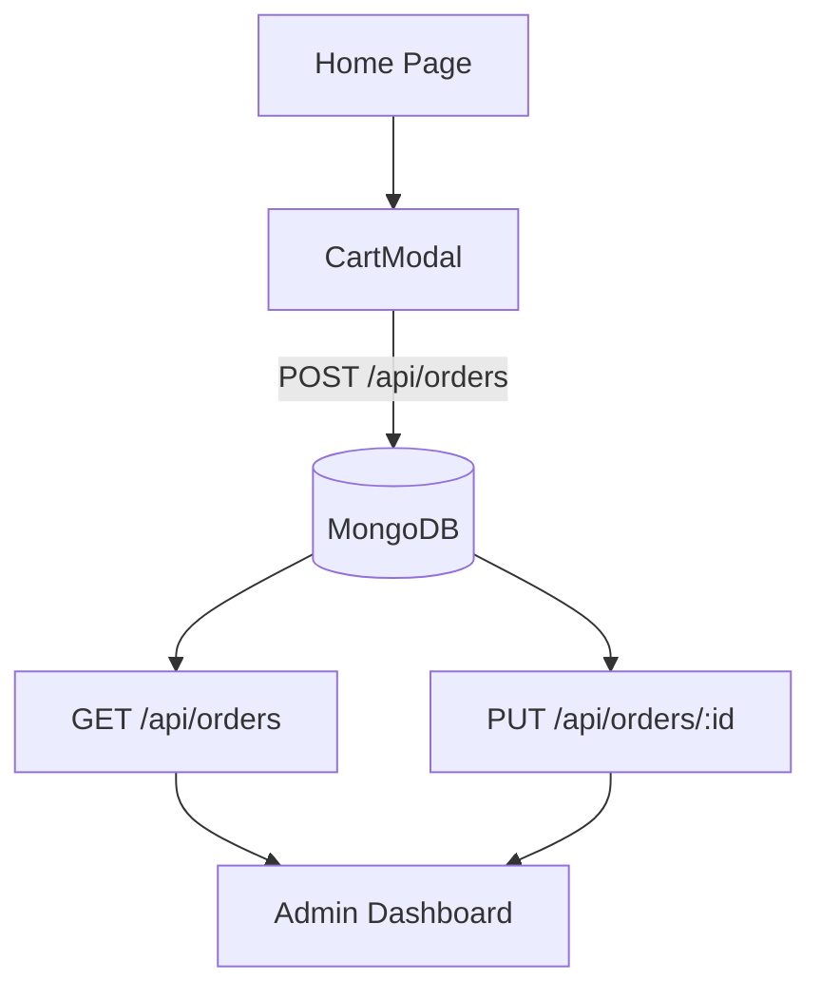
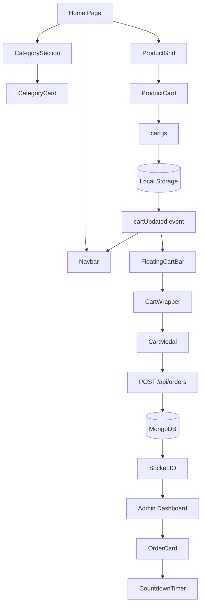
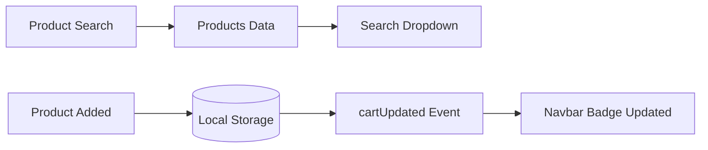
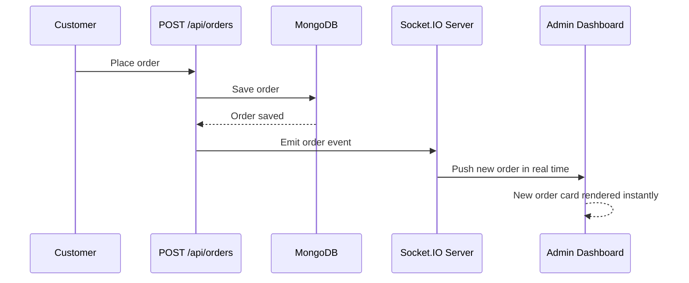
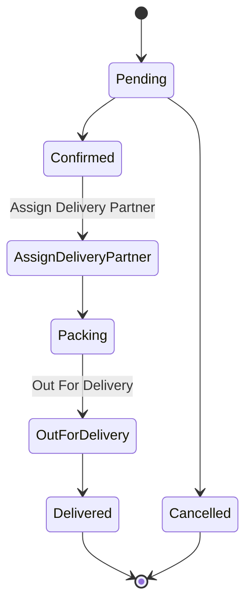

# OG Mart

**A full-stack quick commerce application with real-time order management.**

Customers browse products, search by category or name, add items to a cart, and place orders in minutes. Unlike a static e-commerce site, OG Mart pushes every new order to the Admin Dashboard **instantly via Socket.IO** — no refresh required.

Built on the Next.js App Router with a clean, component-based architecture designed to be easy to understand, maintain, and scale.



---

## Table of Contents

- [Current Features](#current-features)
- [Tech Stack](#tech-stack)
- [Project Structure](#project-structure)
- [Pages](#pages)
- [API Routes](#api-routes)
- [Components](#components)
- [Libraries (lib/)](#libraries-lib)
- [Database Models](#database-models)
- [Socket.IO Architecture](#socketio-architecture)
- [Order Lifecycle](#order-lifecycle)
- [Local Setup](#local-setup)
- [Environment Variables](#environment-variables)
- [Screenshots](#screenshots)
- [Author](#author)

---

## Current Features

### Customer Side
- Browse product categories
- Browse products
- Search products instantly
- Add products to cart
- Automatic quantity management
- Floating cart bar
- Checkout form
- Order success modal
- Responsive mobile UI

### Admin Side
- Live order dashboard
- Real-time orders via Socket.IO
- Order confirmation
- Order cancellation
- Delivery partner assignment
- Order status updates
- Countdown timer for pending orders

### Backend
- MongoDB integration
- REST APIs
- Mongoose models
- Socket.IO server
- Order validation
- Database connection caching

---

## Tech Stack

| Category | Technology |
|---|---|
| Frontend | Next.js (App Router), React |
| Styling | Tailwind CSS |
| Database | MongoDB |
| ODM | Mongoose |
| Real-time Communication | Socket.IO |
| Icons | Lucide React |
| Image Optimization | Next.js Image |
| State Management | React Hooks + LocalStorage |

---

## Project Structure

```
OG-Mart
├── app/
│   ├── admin/          # Admin dashboard
│   ├── api/            # Backend API routes
│   ├── category/       # Dynamic category pages
│   └── page.js         # Home page
│
├── components/
│   ├── Admin/
│   ├── Cart/
│   ├── Category/
│   ├── Product/
│   ├── Modals/
│   └── Navbar.js
│
├── lib/                 # Shared utilities
├── models/               # Mongoose schemas
├── data/                 # Static project data
├── public/
├── server.js             # Custom server + Socket.IO
└── package.json
```

| Folder | Responsibility |
|---|---|
| `app/` | All application pages and backend API routes |
| `app/page.js` | Home page |
| `app/admin/` | Admin dashboard |
| `app/category/` | Dynamic category pages |
| `app/api/` | Backend APIs |
| `components/` | Reusable UI components — every screen is built by combining these |
| `lib/` | Reusable helper utilities: cart management, MongoDB connection, Socket.IO client |
| `models/` | MongoDB schemas — currently `User` and `Order` |
| `data/` | Static data: categories, products, delivery partners |
| `server.js` | Custom Next.js server integrated with Socket.IO for real-time communication between customers and the Admin Dashboard |

---

## Pages

| Page | Purpose | Main Components |
|---|---|---|
| `app/page.js` (Home) | Primary customer entry point — browse categories, view/search products, manage cart, checkout | Navbar, CategorySection → CategoryCard, ProductGrid → ProductCard, FloatingCartBar, CartModal → SuccessModal |
| `app/category/[slug]/page.js` | Displays products for a selected category, resolved dynamically from the URL slug | Navbar, ProductCard, CartWrapper → FloatingCartBar, CartModal |
| `app/admin/page.js` | Real-time dashboard for managing incoming orders — status updates, delivery assignment, live updates without reload | OrderCard → CountdownTimer, Customer Details, Ordered Items, Delivery Partner, Status Actions |

**Home Page data flow**



**Category Page navigation flow**



---

## API Routes

All backend APIs live under `app/api/orders/`.

```
app/api
└── orders
    ├── route.js         # GET, POST
    └── [id]/route.js    # PUT
```

| Endpoint | Method | Purpose | Used By |
|---|---|---|---|
| `/api/orders` | `GET` | Returns all customer orders, sorted latest first | Admin Dashboard |
| `/api/orders` | `POST` | Creates a new order — validates fields, generates a verification code, saves to MongoDB, and emits a Socket.IO event. **The most important API in the project**: it connects the customer app to the admin dashboard | CartModal |
| `/api/orders/:id` | `PUT` | Updates order status and/or assigns a delivery partner | OrderCard (Admin Dashboard) |

**Order creation flow (POST /api/orders)**



**Complete API relationship**



---

## Components

The `components/` directory holds all reusable UI building blocks. Each screen is assembled by composing these pieces rather than writing page-specific markup.

```
components
├── Navbar.js
├── Product/
│   ├── ProductGrid
│   └── ProductCard
├── Category/
│   ├── CategorySection
│   └── CategoryCard
├── Cart/
│   ├── FloatingCartBar
│   ├── CartWrapper
│   └── CartModal
├── Admin/
│   ├── OrderCard
│   └── CountdownTimer
└── Modals/
    └── SuccessModal
```

| Component | Responsibility |
|---|---|
| **Navbar** | Branding, delivery location, product search with suggestions/dropdown, live cart badge, mobile bottom navigation |
| **ProductGrid** | Loads products, renders a responsive grid of `ProductCard`s, section heading |
| **ProductCard** | Product image, pricing, discount calculation, savings calculation, add-to-cart button with "added" animation |
| **CategorySection** | Loads category data, renders `CategoryCard`s, highlights active category, loading skeleton |
| **CategoryCard** | Category icon, title, navigation to the category page, active state |
| **FloatingCartBar** | Floating checkout button — shows total items, total price, opens `CartModal`, auto-updates |
| **CartWrapper** | Controller between `FloatingCartBar` and `CartModal` — opens/closes modal, shares cart state |
| **CartModal** | Full checkout: cart display, quantity management, customer info form, validation, order creation, opens `SuccessModal` |
| **SuccessModal** | Order confirmation message, confirmation button, optional auto-close |
| **OrderCard** | Full order view for admins: customer details, items, payment info, status, delivery partner, status actions |
| **CountdownTimer** | Two-minute countdown for new pending orders, with color transitions and an expired state |

**Component dependency diagram**



**Navbar search & cart badge flow**



---

## Libraries (`lib/`)

Centralized helper modules shared across the app — avoids duplicating logic across components and API routes.

```
lib
├── cart.js
├── dbConnect.js
└── socket.js
```

| File | Purpose | Why It Exists |
|---|---|---|
| `cart.js` | Central shopping cart manager — adds products, prevents duplicates, increases quantity, persists to Local Storage, and fires a `cartUpdated` event consumed by `Navbar`, `FloatingCartBar`, and `CartModal` | Without it, every component would duplicate cart logic |
| `dbConnect.js` | Creates and manages the MongoDB connection, reused by every API route needing database access | Connection caching avoids creating a new connection per request → better performance, lower memory usage, faster responses |
| `socket.js` | Provides one shared Socket.IO client instance for the whole app | Avoids opening multiple redundant socket connections |

---

## Database Models

`models/` defines how data is stored in MongoDB.

```
models
├── User
└── Order
```

### User

| Field | Notes |
|---|---|
| Name | |
| Phone | |
| Address | |
| Image | |
| Role | |

The current MVP stores basic customer information; the model is already structured to support a future authentication system.

### Order

| Field | Notes |
|---|---|
| Customer Information | Snapshot of name, phone, address at order time — later changes to customer data don't affect past orders |
| Order Verification Code | Generated on creation |
| Ordered Items | Array of `{ Product, Price, Quantity }` |
| Total Amount | |
| Payment Type | Cash on Delivery (currently implemented) or Online Payment |
| Delivery Partner | `{ ID, Name, Phone }`, assigned after confirmation |
| Order Status | See [Order Lifecycle](#order-lifecycle) |
| Timestamps | |

---

## Socket.IO Architecture

OG Mart uses Socket.IO to eliminate manual page refreshes — when a customer places an order, the Admin Dashboard updates automatically.



| Without Socket.IO | With Socket.IO |
|---|---|
| Customer places order → Admin must refresh page → Order appears | Customer places order → Admin Dashboard updates automatically |

---

## Order Lifecycle



---

## Local Setup

```bash
# 1. Clone the repository
git clone <repo-url>
cd OG-Mart

# 2. Install dependencies
npm install

# 3. Configure environment variables
cp .env.example .env.local
# then fill in the values — see table below

# 4. Start the development server
# (runs the custom Next.js server together with the Socket.IO server)
npm run dev
```

Open the customer app at **http://localhost:3000**.

---

## Environment Variables

| Variable | Purpose |
|---|---|
| `MONGODB_URI` | MongoDB database connection string |

---

## Screenshots

> Placeholders — add screenshots to `docs/` and reference them below.

```
docs/
├── home.png
├── category.png
├── cart.png
├── checkout.png
├── success.png
├── admin.png
└── order-card.png
```

| Screen | Image |
|---|---|
| Home Page | `docs/home.png` |
| Category Page | `docs/category.png` |
| Search Dropdown | — |
| Product Card | — |
| Floating Cart | — |
| Cart Modal | `docs/cart.png` |
| Success Modal | `docs/success.png` |
| Admin Dashboard | `docs/admin.png` |
| Order Card | `docs/order-card.png` |
| Countdown Timer | — |

---

## Project Highlights

- Reusable, component-based UI
- Clear separation between pages, components, APIs, and models
- Shared utility functions to avoid duplicate logic
- Real-time order management via Socket.IO
- Clean, scalable folder organization
- Mobile-first responsive interface

---

## Author

**Piyush Tamrakar**
Full Stack Web Developer

Next.js · React · Tailwind CSS · MongoDB · Mongoose · Socket.IO